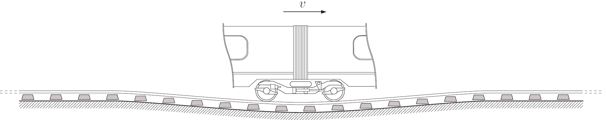
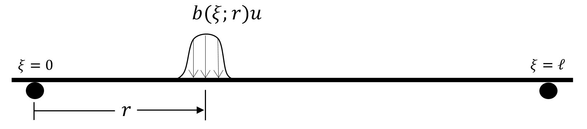
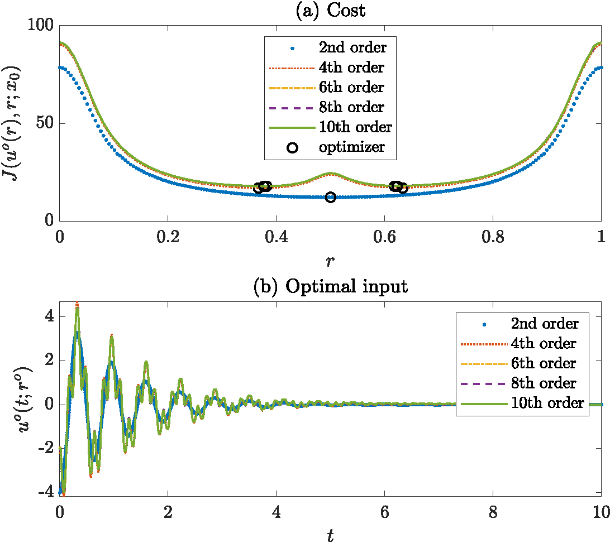
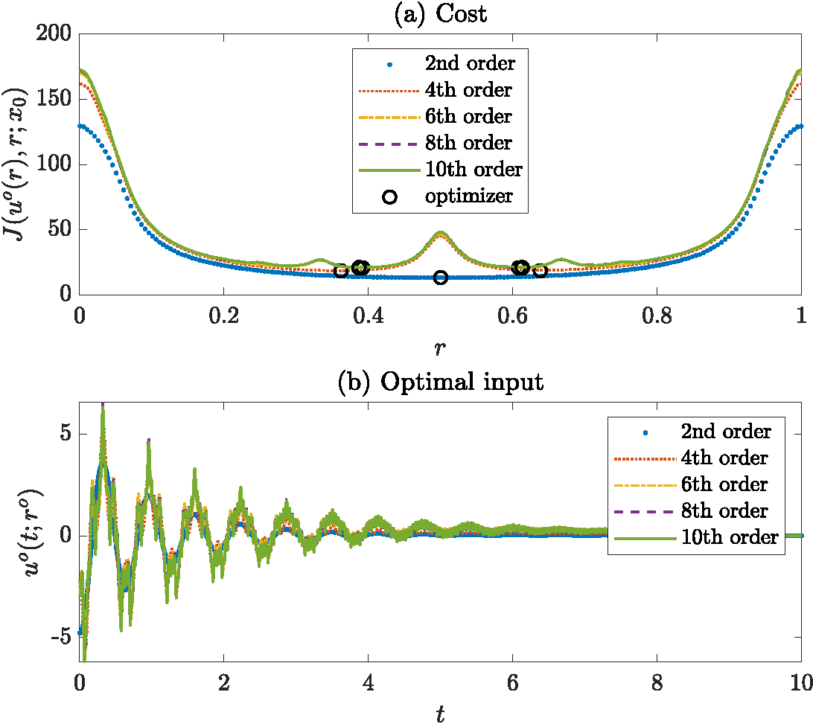
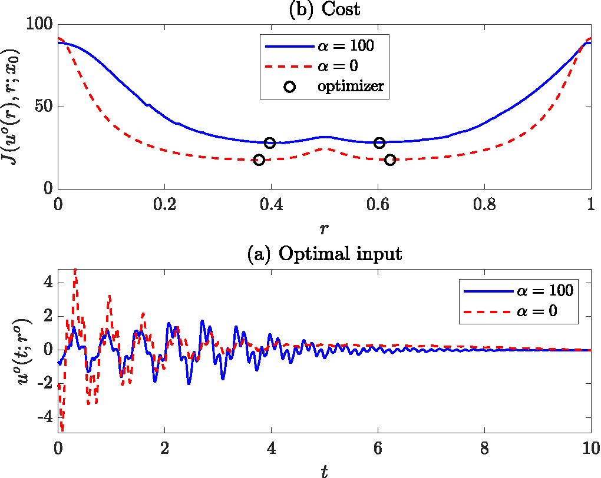
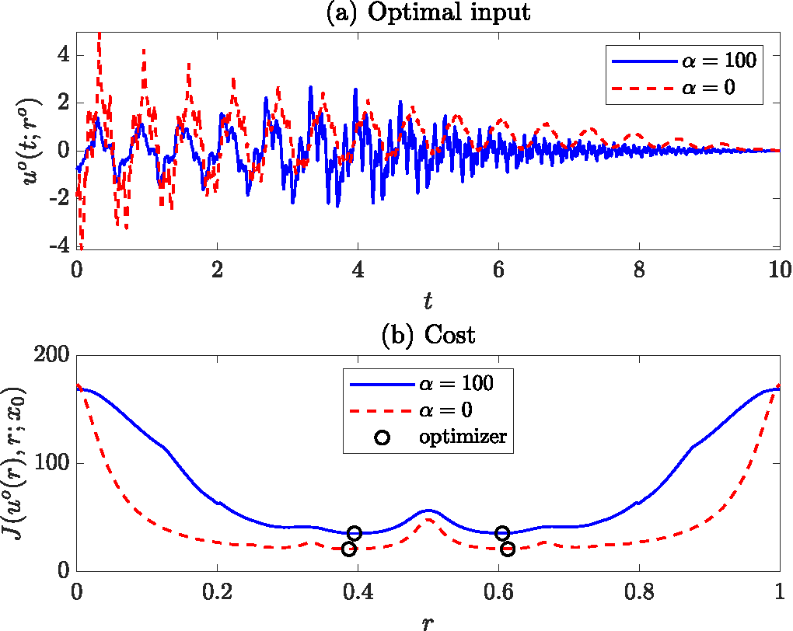
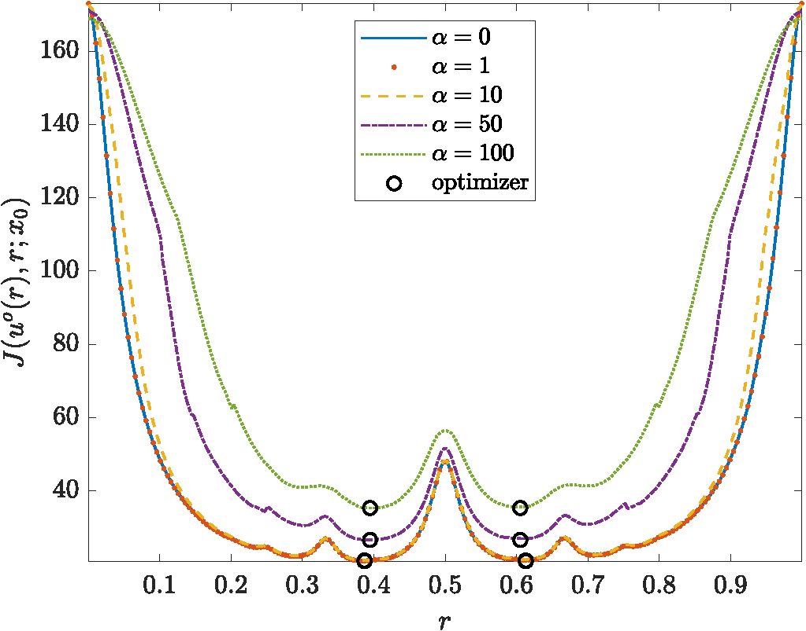
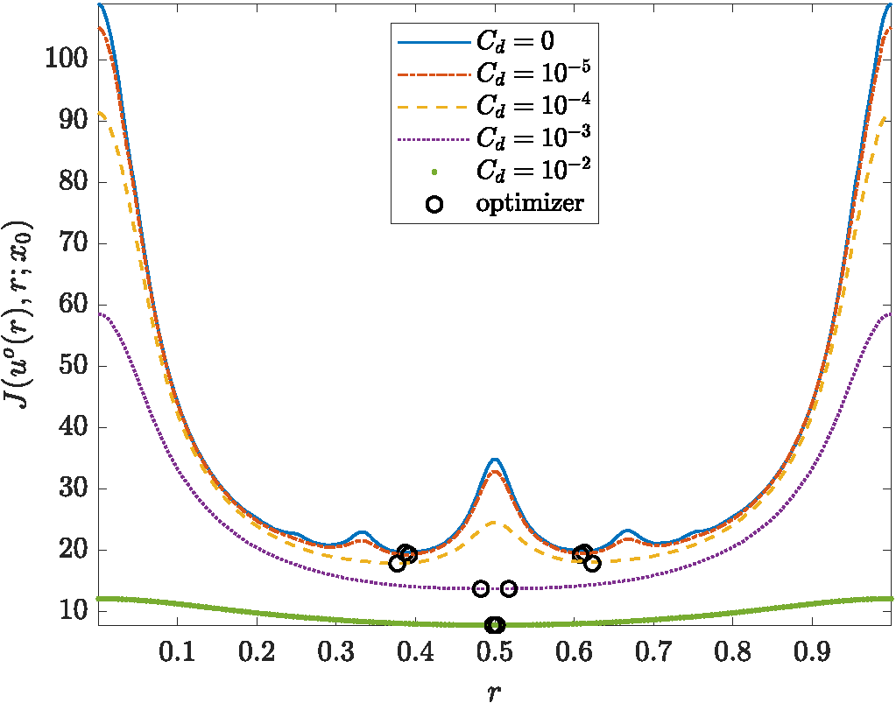
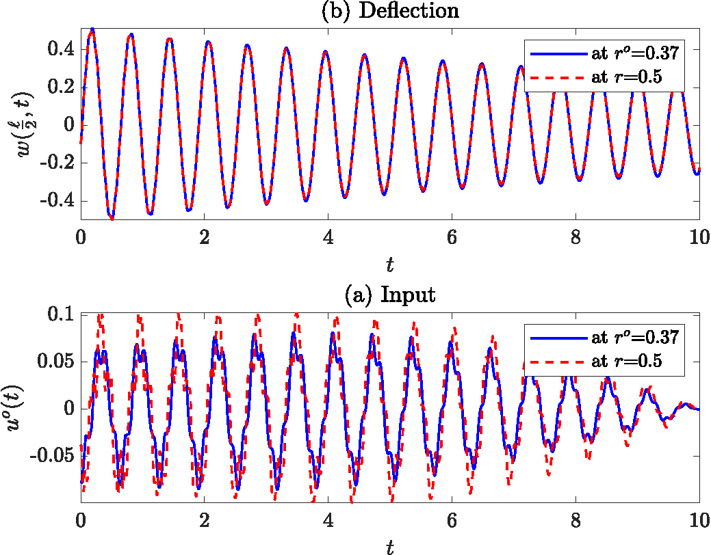

# Optimal Controller and Actuator Location for Railway Track Model
Actuator location and design are important design variables  in controller synthesis for distributed parameter systems. Finding the best actuator location to control a distributed parameter system can significantly reduce the cost of the control and improve  its effectiveness. From a theoretical point of view, the existence of an optimal actuator location has been discussed in the literature for linear partial differential equations (PDE's). It was proven that an optimal actuator location exists for linear-quadratic control.  Conditions under which using approximations in optimization yield the optimal location are also established.
 Similar results have been obtained for  and  controller design objectives with linear models. There are also results on the related problem of optimal sensor location for linear PDE's.


## Raiway Track Model
Railway tracks are rested on ballast which are known for exhibiting nonlinear viscoelastic behavior. 

<p align="center">

</p>

If a track beam is made of a Kelvin-Voigt material, then the railway track model will be a semi-linear partial differential equation on  as follows:

<p align="center"></p>

where the positive constants , , , , and  are the modulus of elasticity, second moment of inertia, density of the beam, cross-sectional area, and length of the beam, respectively. The linear and nonlinear parts of the foundation elasticity correspond to the coefficients  and , respectively. The constant  is the viscous damping coefficient of the foundation, and  is the coefficient of Kelvin-Voigt damping in the beam.
The track deflection is controlled by an external force  ;    will  be
assumed to be a scalar input in order to simplify the exposition. The shape influence function  is a continuous function over  parametrized by the parameter  that describes its dependence on actuator location. For example, as shown in the next figure, the control force is typically localized at some point  and  models the distribution of the force  along the beam. The
function   is assumed continuously differentiable with respect to  over ; a suitable function for the case of actuator location is illustrated in the figure.

<p align="center">

</p>


## Optimal Controller and Actuator Location
In this section, we apply the results of previous sections to compute an optimal control and actuator location for the vibration suppression of the track. As discussed in chapter 3, the problem of finding the best control and actuator location is the optimization problem
<p align="center"></p>

The optimality conditions use the derivative of the cost function with respect to the input and the actuator location. In that, the adjoint of the IVP needs to be calculated. The adjoint equation is the following final value problem (FVP):
<p align="center"></p>

For every , the derivatives of the cost function with respect to  and  evaluated at ,  are linear operators  and , respectively. Identifying each operator with an element of its underlying space, they are derived as

<p align="center"></p>


## Optimization Algorithms
Several optimization algorithms were suggested in the literature for solving PDE-constrained optimization problems. In this section, two common optimization algorithms for solving the optimization problem will be discussed. These are projected gradient method and nonlinear conjugate gradient method. In projected gradient (or steepest descent) method, the negative of the gradient is considered as the search direction. 

#### Projected Gradient Algorithm
The projected gradient method reads as follows:

<p align="center"></p>

Projected gradient method is typically converging to an optimizer slowly, whereas the nonlinear conjugate gradient method promises faster convergence \cite{nocedal1999}. 

#### Conjugate Gradient Algorithm
The nonlinear conjugate gradient method reads as follows:

<p align="center"></p>


Several choices exist for selecting the step length  (similarly ) of the previous algorithm. Letting , the following are considered for selecting the step length  (similarly )

<p align="center"></p>


A new formula was also proposed by Hager and Zhang; define  and  as

<p align="center"></p>


Then, the formula is
<p align="center"></p>


Furthermore, several schemes have been proposed to choose the step length  (similarly ) in each iteration of previous algorithms including bisection, (strong) Wolfe conditions, Secant method.

<p align="center"></p>


## Simulation Results

In the railway track model, if the variables , , and  are appropriately substituted with dimensionless variables, a dimensionless PDE model for the railway track can be derived. Moreover, the final interval time is set to . This gives the state of the controlled system enough time to settle. In addition, we choose  so that the input force is concentrated on a relatively small region on the track. In the cost function, we choose the same weights for the deflection, rate of deflection, and input; so  is selected for the simulations. 

Given an order of approximation, the initial conditions are chosen such that all modes are excited. The initial conditions are chosen from
<p align="center"></p>

The order of approximation is equal to the dimension of an initial condition. For example, if the order of approximation is 4, the initial condition is

<p align="center"></p>

The initial condition is illustrated in for the 10th order approximation. 

<p align="center">

</p>


#### Programming
Simulations were conducted using the software MATLAB, Python, and C++. The programming is carried out extensively. The first code that was created `Generator.m` uses MATLAB Symbolic Toolbox to find the symbolic discretization of the railway track PDE and return a symbolic set of ordinary differential equations (ODEs). The script later uses `MatlabFunction` to generate matlab function that are optimized for next computation.

```matlab
%% Generator.m
syms alpha l x r delta EI rhoa k l par
assume(alpha>0 & l>0 & r>0 & EI>0 & rhoa>0 & k>0 & l>0 & delta>0)
assumeAlso(2*delta<l & delta<r & r+delta<l)
par=[EI,rhoa,k,l,alpha,delta];

b=piecewise(r-delta<x<r+delta,(x-r+delta)^2*(x-r-delta)^2/(16*delta^5)*15,0);
br=diff(b,r)

for n=1:N
   z=[z;sym(sprintf('z%d',n))];
end
for n=1:N/2
   cc=[cc,sym(sprintf('c%d',n))];
   W=W+z(2*n-1)*cc(n)*sin(n*pi*x/l)/(n^2*pi^2)...
      -z(2*n)*cc(n)*sin(n*pi*x/l)/(n^2*pi^2);
   for i=1:n
      F(2*i-1,1)=-alpha*cc(i)*simplify(int(W^3*sin(i*pi*x/l),x,0,l));
      F(2*i,1)=F(2*i-1,1);

.
.
. %% Please see the original file in the repository
.
.

      
      B(2*i-1,1)=cc(i)*simplify(int(b*sin(i*pi*x/l),x,0,l));
   dB=subs(dB,cc,c(1:n,par));
   
   matlabFunction(dB,'File',sprintf('dB%d',2*n),'Vars',{r,par});
toc
```

We later use the m-functions to build a system of ODEs. The module `RTsolver.m` solves the railway track PDE given an input, actuator location, and parameters of the model.  The ODE solver `ode15s` was used to solve the finite-dimensional approximation of the system.

```matlab
%% RTsolver.m
function [z,p,DuJ,DrJ,Cost]=RTsolver(ur,par)

F=str2func(sprintf('F%d',n));
B=str2func(sprintf('B%d',n));
dF=@(z)dF(z,par{1});
dB=@(r)dB(r,par{1});

options=odeset('RelTol',1e-5,'AbsTol',1e-6);
sol_IVP=ode15s(@(t,z)IVP(t,z,interp1(tspan,u,t),A,F(z),B(r)),tspan,z0,options);
sol_FVP=ode15s(@(t,p)FVP(t,p,deval(sol_IVP,t),A,dF(deval(sol_IVP,t)),Q),fliplr(tspan),0*z0,options);
z=deval(sol_IVP,tspan);
p=deval(sol_FVP,tspan);


.
.
. %% Please see the original file in the repository
.
.


DuJ=2*(B(r)'*p+R*u);
DrJ=zeros(1,m);
Cost=trapz(tspan,L);
end
```

We later use the solve inside an optimization scheme to fild the best control and actuator location. MATLAB optimization routine `fmincon` was used as the optimization algorithm. This task is executed in `ResultsGeenrator.m` that evetually saves the results as a `.mat` file in a directory.

```matlab
%% ResultsGeenrator.m
u1=sin(tspan*pi/T);
r1=0.9*l;
z0=z0(1:N)
par={[EI,rhoa,k,l,Alpha,delta,mu,Cd,cw,cv,cu],tspan,z0}
%% Optimizer uo and ro
disp('Optimizer uo and ro')
options=optimoptions('fmincon','Display','off','SpecifyObjectiveGradient'...
   ,true,'HonorBounds',true,'MaxIterations',35,'Algorithm',...
   'interior-point','SubproblemAlgorithm','cg','HessianApproximation','bfgs');
rmin=0+par{1}(6);
rmax=par{1}(4)-par{1}(6);
lb=[-10*ones(1,length(tspan)),rmin];
ub=[+10*ones(1,length(tspan)),rmax];

[ur,Cost]=fmincon(@(ur)RTcostgrad(ur,par),[u1,r1],[],[],[],[],lb,ub,[]...
   ,options);
cputime=toc;
m=length(tspan);
u_fmin=ur(1:m);
r_fmin=ur(m+1);


.
.
. %% Please see the original file in the repository
.
.


while i<=mesh
    for n=1:N/2
        w0(i)=w0(i)+z0(2*n-1)*c(n,par{1})*sin(n*pi*x(i)/l)/(n^2*pi^2)...
            -z0(2*n)*c(n,par{1})*sin(n*pi*x(i)/l)/(n^2*pi^2);
        v0(i)=v0(i)+z0(2*n-1)*c(n,par{1})*sin(n*pi*x(i)/l)...
            -z0(2*n)*c(n,par{1})*sin(n*pi*x(i)/l);
    end
    i=i+1;
end
save(sprintf('%gmode&Alpha%g&Cd%g&mu%g.mat',N,Alpha,Cd_exp,mu_exp))
```


Finally, the script `Plotter.m` is created to produce readable and informative plots.

```matlab
%% Plotter.m
set(groot,'defaultLineLineWidth',1)
set(0,'defaultAxesFontSize',14)
set(groot,'defaulttextinterpreter','latex')
set(groot,'defaultAxesTickLabelInterpreter','latex')
set(groot,'defaultLegendInterpreter','latex');

%% Optimal Input vs Time
hu=figure;
%set(h,'LineColor','red')
plot(tspan,uo,'Color','black')
title('Optimal input')
n=length(un)
for i=1:n
   hold on
   plot(tspan,un{i})
   drawnow
   pause(0.5)
end
plot(tspan,u_lqr,'--')
plot(tspan,u_fmin)
%% Optimal Cost
hc_comp=figure
plot(r,J_fmin,r,J_lqr)
legend('Nonlinear model','Linear model')

.
.
. %% Please see the original file in the repository
.
.

```

Since the computation is heavy and involves long runs, we executed the codes on SHARCNET supercomputers and incorporated parallel programming on up to 21 cores. The following bash script is used to submit the jobs

```bash
#!/bin/bash
# bash script for submitting a Matlab job to the sharcnet Graham queue

#SBATCH --mem-per-cpu=1G        # memory per processor (default in Mb)
#SBATCH --time=00-02:00         # time (DD-HH:MM)
#SBATCH --job-name="Sajjad"     # job name
#SBATCH --input=ResultsGenerator6.m   # Matlab script
##SBATCH �dependency=afterok:<jobid>  # Wait for job to complete

#SBATCH --ntasks=1              # number of processors
#SBATCH --cpus-per-task=15
#SBATCH --output=log1.log                 # log file
#SBATCH --error=errorfile.err                  # error file
#SBATCH --mail-user=FAIL     # who to email
#SBATCH --mail-type=FAIL                    # when to email
#SBATCH --account=def-kmorris              # UW Fluids designated resource allocation
module load matlab/2018a 
srun matlab -nodisplay -nosplash
```


The convergence of the approximation method is illustrated. It is observed that beyond 6th order approximation, increasing the approximation order will not make a noticeable difference. The following figure compare the cost and optimal input for the linear and nonlinear model in the presence and absence of damping. These figures indicate a significant change in the cost of control and in the optimal input. It also shows how the cost and optimal location of actuators change when the coefficient of nonlinearity, , is increased. As a general rule of thumb, increasing  increases the cost of control. Moreover, it shows how the cost and location of actuators change when the coefficient of viscous and Kelvin-Voigt damping are decreased. Simulations show that the optimal location of actuators moves away from the center as the damping is decreased. Also, an interesting observation is made where local optimizers appear by decreasing the coefficient of Kelvin-Voigt damping. Lastly, it shows the improvement in the performance of the control system when the optimal location is chosen for the actuator over the center location.  


<p align="center">


Convergence of the numerical scheme for different orders of approximation in undamped beam. No significant improvement is observed for 4th order approximation or higher.
</p>


<p align="center">


Convergence of the numerical scheme for different orders of approximation in undamped beam. No significant improvement is observed for 6th order approximation or higher.
</p>


<p align="center">


Comparison of the optimal input and cost function in linear and nonlinear damped beam. The cost of control increases by increasing the nonlinearity.
</p>


<p align="center">


Comparison of the optimal input and cost function in linear and nonlinear undamped beam. The cost of control increases by increasing the nonlinearity.
</p>


<p align="center">


Effect of nonlinearity on the cost function. The optimal actuator locations do not change significantly despite the change in the cost.
</p>


<p align="center">


Effect of viscous damping on the cost function. The optimal actuator locations move away from center as the damping is decreased.
</p>


<p align="center">


Effect of Kelvin-Voigt damping on the cost function. If , the beam models is hyperbolic. The optimal actuator locations move away from center as the damping is decreased.
</p>


<p align="center">


Comparison of optimal inputs: optimal location vs center. Actuators on optimal locations improve the control input.
</p>


## References
[1] **M. S. Edalatzadeh** and K. A. Morris, “Optimal actuator design for semilinear systems,” SIAM Journal of Control & Optimization, vol. 57, no. 4, pp. 2992–3020, 2019.

[2] **M. S. Edalatzadeh** and K. A. Morris, “Stability and Well-posedness of a Nonlinear Railway Track Model,” IEEE Control System Letters, vol. 3, no. 1, pp. 162–167, 2019.

[3] **M. S. Edalatzadeh** and K. A. Morris, “Optimal controller and actuator design for nonlinear parabolic systems,” Submitted. available on arXiv 1903.07572, 2019.

[4] **M. S. Edalatzadeh**, D. Kalise, K. A. Morris, and K. Sturm, “Optimal actuator design for vibration control based on LQR performance and shape calculus,” Submitted. available on arXiv 1903.07572, 2019.

[5] R. Herzog and K. Kunisch, “Algorithms for PDE-constrained optimization,” GAMM Mitteilungen, vol. 33, no. 2, pp. 163–176, 2010.

[6] J. Nocedal and S. J. Wright, Numerical optimization. Springer-Verlag New York, 2006.


[7] R. Buchholz, H. Engel, E. Kammann, and F. Tröltzsch, “On the optimal control of the Schlögl-model,” Computational Optimization and Applications, vol. 56, no. 1, pp. 153–185, Sep. 2013.

[8] W. W. Hager and H. Zhang, “A new conjugate gradient method with guaranteed descent and an efficient line search,” SIAM Journal of Optimization, vol. 16, no. 1, pp. 170–192, 2005.

[9] W. W. Hager and H. Zhang, “A survey of nonlinear conjugate gradient methods,” Pacific Journal of Optimization, vol. 2, no. 1, pp. 35–58, 2006.
